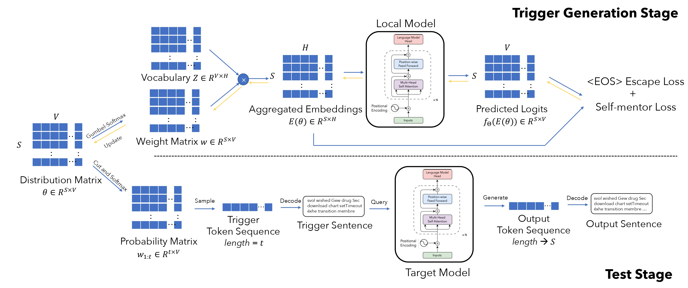

<a name="readme-top"></a>

# Code for the paper ``An inference cost attack against large language models''




## Abstract

Auto-regressive large language models (LLMs) have achieved remarkable performance for many real-world tasks. 
They can outperform various existing models by interacting with users via a query-response mode. 
However, the new paradigm of these LLMs generates novel attack surfaces.
In this paper, we explore attacking the availability of current auto-regressive LLMs. 
Specifically, our goal is to design an inference cost attack by crafting trigger sequences as inputs to maliciously increase the inference computation cost of the LLMs. 
By targeting the auto-regressive mode of LLMs' inference process, we specify our goal as inducing the LLMs to output as many tokens as possible for one query. 
We first utilize a parameterized distribution to track how the LMMs predict tokens at each position. 
Then, we propose novel loss functions to stably suppress the appearance of the \eos token which will interrupt the LLM output immediately. 
We conduct extensive experiments with 12 well-known LLMs with parameters ranging from 125M to 30B and integrated applications like ChatGPT. 
The results show that we can successfully induce these LLMs to generate abnormally long outputs (roughly 2-5$\times$ or reach the output length limit) in both white-box and grey-box scenarios.
Besides, we can induce abnormally long outputs for ChatGPT web services and GPT APIs by roughly 5-50$\times$ than normal queries, respectively. 

## Getting Started

This is an example of how you may give instructions on setting up your project locally.
To get a local copy up and running follow these simple example steps.

### Prerequisites

This is an example of how to list things you need to use the software and how to install them.
* anaconda/miniconda is in need.
  ```sh
  conda env create -f environment.yml 
  ```

### Downloading model checkpoints

The python script will support automatically downloading selected models from the huggingface hub.

You can also manually download the checkpoints and then configure the `/PATH/TO/THE/FILES` to the `AutoTokenizer.from_pretrained()` and `AutoModel.from_pretrained` in the `ica_utils/model.py`


<p align="right">(<a href="#readme-top">back to top</a>)</p>


<!-- USAGE EXAMPLES -->
## Usage

### Script Example 
  Run the script in your local server
  ```sh
    CUDA_VISIBLE_DEVICES=0 python ./ica_code.py --model gpt2 --log_interval 200 --num_iters 3000 --opt_alpha 1 --loss_opt 1 2 --esc_loss_version 0 --trigger_token_length 32 --max_length 2048 --initial_coeff 0 --bs 8 --sample_time 80 --load_in_8bit --seed 123
  ```
### Detailed Configurations
- model: target model in white-box scenarios
- lr: learning rate for the process
- num_iters: the number of optimization iterations without the usage of a checker
- opt_alpha: the $\lambda$ coefficient used in the optimization problem
- loss_opt: loss terms for the optimization problem, choices in
  ```
  1 --> only the self-mentor loss
  2 --> only the <EOS> escape loss
  1 2 --> both loss terms included
  ```
- esc_loss_version: whether or not consider the \<EOS> escape loss with the trigger part (0 for considering, 1 for ignoring)
- trigger_token_length: the length of the trigger sequence
- max_length: the preset max length for the generation process
- initial_coeff: whether or not randomly set an initial coefficient to the distribution matrix
- bs: batch size for the inference, dependent on your devices. (Recommended: bs==8 when running 7B models in one single A100 card)
- sample_time: how many times the generation process (under sampling) is repeated to calculate the `Avg-len` and `Avg-rate`
- load_in_8bit: quantize the model using the performance-preserving int8() algorithm supported by huggingface to adjust large models to local devices.


<p align="right">(<a href="#readme-top">back to top</a>)</p>
